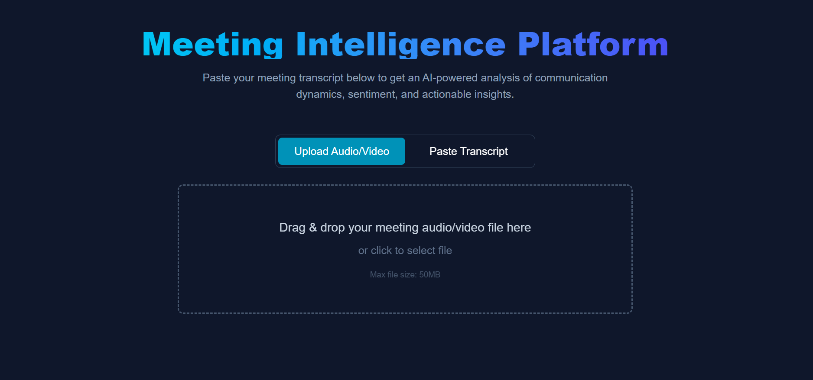

# Meeting Intelligence Platform

Tired of unproductive meetings where great ideas get lost and some voices go unheard? This project transforms raw meeting recordings into actionable, unbiased insights. It's a full-stack web application that leverages state-of-the-art AI to transcribe, identify speakers, and analyze conversational dynamics to foster more inclusive and effective team collaboration.

-----
## Demo
Watch a quick walkthrough video below:

[](./Demo.mp4)

## Core Features

  * **Audio/Video Analysis:** Simply upload a meeting recording (MP3, MP4, WAV, etc.) and let the platform handle the rest.
  * **Automatic Speaker Diarization:** The magic happens here. Using AssemblyAI, the tool automatically detects and separates different speakers (`Speaker A`, `Speaker B`) from a single audio track.
  * **GenAI-Powered Insights:** Google Gemini analyzes the conversation to detect speaker dominance, interruptions, key sentiments, and extracts a concise summary with actionable tasks.
  * **Interactive Dashboard:** Don't just read a report—engage with it\! Assign real names to the detected speakers (`Speaker A` -\> `Sarah`), and watch the entire analysis update in real-time.
  * **Dual-Mode Input:** No recording? No problem. You can also paste a pre-written transcript for a quick, text-based analysis.

-----

## Tech Stack

  * **Frontend:** Next.js, React, TypeScript, Tailwind CSS
  * **Backend:** Next.js API Routes (Serverless Functions)
  * **AI & ML Services:**
      * **AssemblyAI:** For speech-to-text transcription and speaker diarization.
      * **Google Gemini:** For natural language understanding, summarization, and analysis.
  * **Containerization:** Docker

-----

## Getting Started

Follow these steps to get the project running on your local machine.

### 1. Prerequisites

Make sure you have the following installed:

  * [Node.js](https://nodejs.org/en/) (v18 or later)
  * [Docker](https://www.docker.com/products/docker-desktop/) (optional, for containerized setup)
  * [Git](https://git-scm.com/)

### 2. Clone the Repository

```bash
git clone https://github.com/your-username/meeting-intelligence-platform.git
cd meeting-intelligence-platform
```

### 3. Install Dependencies

```bash
npm install
```

### 4. Set Up Environment Variables

This is the most important step. You'll need API keys from both Google and AssemblyAI.

1.  Create a file named `.env.local` in the root of the project.
2.  Copy the contents of `.env.example` (if provided) or use the template below.
3.  Add your API keys:

<!-- end list -->

```
# .env.local

# Get your key from Google AI Studio
GOOGLE_API_KEY="YOUR_GOOGLE_GEMINI_API_KEY"

# Get your key from your AssemblyAI dashboard
ASSEMBLYAI_API_KEY="YOUR_ASSEMBLYAI_API_KEY"
```

### 5. Run the Development Server

```bash
npm run dev
```

Open [http://localhost:3000](https://www.google.com/search?q=http://localhost:3000) in your browser to see the application running\!

-----

## Running with Docker

You can also build and run the entire application inside a Docker container.

1.  **Build the Docker image:**

    ```bash
    docker build -t meeting-analyzer .
    ```

2.  **Run the container:**
    Make sure to pass your environment variables from your `.env.local` file.

    ```bash
    docker run -p 3000:3000 \
      -e GOOGLE_API_KEY="YOUR_GOOGLE_GEMINI_API_KEY" \
      -e ASSEMBLYAI_API_KEY="YOUR_ASSEMBLYAI_API_KEY" \
      meeting-analyzer
    ```

The application will be available at [http://localhost:3000](https://www.google.com/search?q=http://localhost:3000).

-----

## Project Structure

The project uses the Next.js App Router, with a focus on component-based architecture.

```
/
|-- app/
|   |-- api/analyze/route.ts  # The core backend logic for both text and audio
|   |-- components/           # All reusable frontend components
|   |   |-- AnalysisForm.tsx
|   |   |-- FileUpload.tsx
|   |   |-- InteractiveResults.tsx
|   |   |-- ...
|   |-- lib/types.ts          # Shared TypeScript type definitions
|   |-- page.tsx              # The main entry point and page layout
|-- public/
|-- Dockerfile                # Instructions for building the container
|-- next.config.mjs           # Next.js configuration
|-- ...
```

-----

## Future Roadmap

This project has a lot of potential for growth. Here are some ideas for future features:

  * **Meeting Coach Dashboard:** Track communication metrics over time to see team improvement.
  * **Calendar Integration:** Connect to Google Calendar or Outlook to automatically fetch and analyze meeting recordings.
  * **Real-time Analysis:** Analyze meeting audio in real-time from the microphone.
  * **Database Integration:** Save and revisit past meeting analyses.